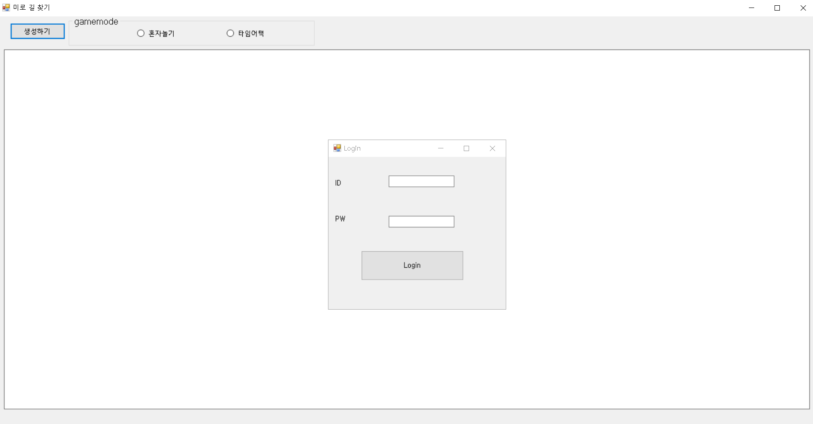

# OSSD2022  (	9조-조용한 하늘에게 행운이 함께 하기를! )
--------------------
## Version  
- C# : .NET Framework 4.5  
- Selenium : 4.0.0
----------------
## 설치 및 실행 방법
1. Download Zip ( https://github.com/mdj1412/OSSD_2022/archive/refs/heads/master.zip )

2. "OSSD_2022" 압축 풀기  

3. OSSD_2022 / MazeRun.exe (실행파일 실행) 
  
    

---------------
## 프로젝트 내용

1. klas에 로그인하기 위한 학번과 비밀번호를 입력 후 로그인 버튼을 누른다
2. GameMode 박스에서 원하는 게임모드를 선택 후 생성하기 버튼을 누른다
3. 해당 모드를 플레이한다
4. 혼자놀기 모드에서 5회 이상 승리 시 klas 접속버튼이 visible하게 된다
5. 게임보드를 클릭하면 klas 버튼이 활성화된다

----------

## Contributors
<table>
  <tr>
    <td align="center">
      <a href="https://github.com/kimjoohyungsd">    <b>김주형</b>  </a>  
    <td align="center">
      <a href="https://github.com/jaewon0926">    <b>정재원</b>  </a>  
    <td align="center">
      <a href="https://github.com/mjswindells">    <b>김희찬</b>  </a>  
    <td align="center">
      <a href="https://github.com/mdj1412">    <b>민동준</b>  </a>  
  </tr>
</table>

-----------
## License
Performance_Helper is licensed under the **[MIT License]**.  

## 오픈소스 출처
https://icodebroker.tistory.com/8124

[MIT License]: https://github.com/mdj1412/OSSD_2022/blob/master/LICENSE
